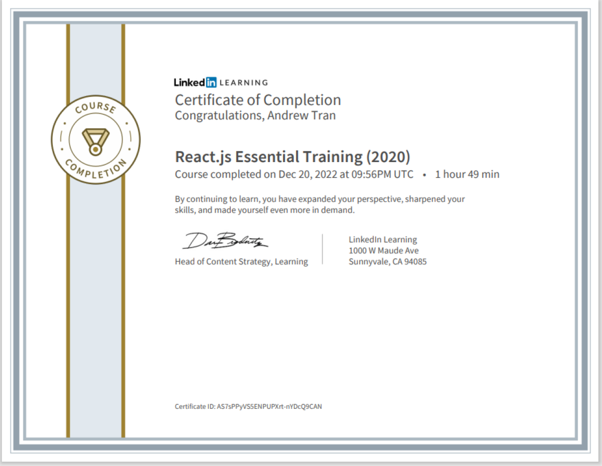

# ReactJS-Essentials-LinkedIn-Course

-In this following repository, I have attached all of the files that I had used when I was going through the 'React.js-Essential-Training' LinkedIn Course in December 2022. Below, here is my certification showing my completion of the LinkedIn Course: 

  

  

-Link to "React.js Essential Training (2020)" LinkedIn Learning Course: [here](https://www.linkedin.com/learning/react-js-essential-training-2020/building-modern-user-interfaces-with-react?autoplay=true&u=57888345)

-Link to React.js Documentation: [here](https://reactjs.org/)
